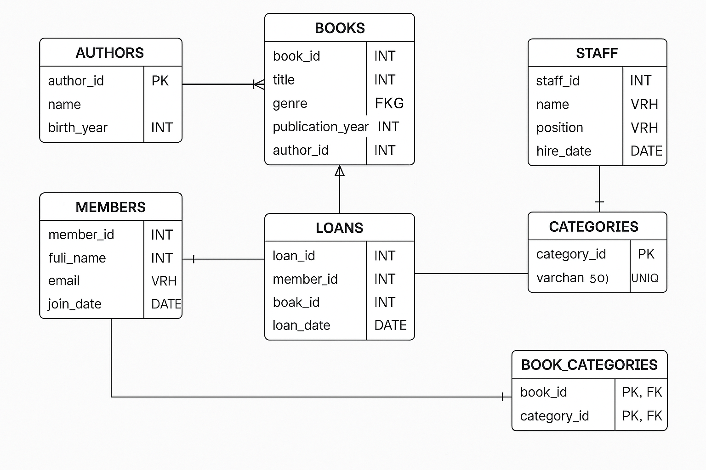

# 📚 Library Management System (MySQL Project)

## 📝 Description
This project is a relational database system designed to manage a small library. It stores and handles information about books, authors, library members, loans, staff, and book categories.

## ⚙️ How to Run / Set Up the Project

1. Open MySQL Workbench or any SQL client.
2. Create a new database (e.g., `CREATE DATABASE library_db;`).
3. Use that database: `USE library_db;`
4. Import the SQL file:
   - If using terminal:  
     `mysql -u [username] -p library_db < library_management.sql`
   - If using Workbench: Open the `.sql` file and run all commands.

Make sure your server is running before importing.

## 🖼️ ERD Screenshot
  

## 📁 Files Included
- `library_management.sql`: Main SQL file containing table creation statements with primary/foreign keys, constraints, and comments.
- `ERD.png`: Entity Relationship Diagram of the database.